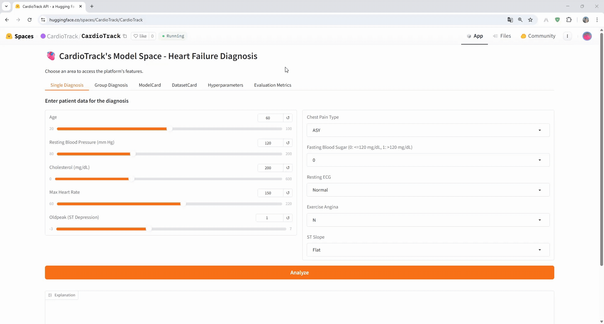
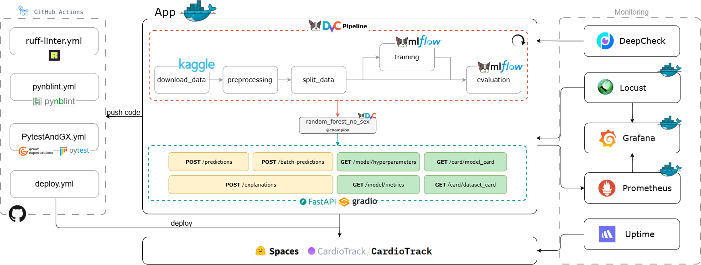

# Predicting Outcomes in Heart Failure
<a target="_blank" href="https://cookiecutter-data-science.drivendata.org/"></a>
[](https://www.python.org/)
[](https://huggingface.co/spaces/CardioTrack/CardioTrack)
[](https://uptime.betterstack.com/?utm_source=status_badge)

[](https://github.com/se4ai2526-uniba/CardioTrack/actions/workflows/ruff-linter.yml)
[](https://github.com/se4ai2526-uniba/CardioTrack/actions/workflows/pynblint.yml)
[](https://github.com/se4ai2526-uniba/CardioTrack/actions/workflows/pytestAndGX.yml)
[](https://github.com/se4ai2526-uniba/CardioTrack/actions/workflows/deploy.yml)

## Table of Contents
1. [Project Summary](#project-summary)
2. [Quick Start Guide](#quick-start-guide)
4. [CardioTrack Architecture](#cardiotrack-architecture)
5. [Milestones Description](#milestones-description)  
   - [Milestone 1 - Inception](#milestone-1---inception)  
   - [Milestone 2 - Reproducibility](#milestone-2---reproducibility)
   - [Milestone 3 - Quality Assurance](#milestone-3---quality-assurance)
   - [Milestone 4 - API Integration](#milestone-4---API-Integration)
   - [Milestone 5 - Deployment](#milestone-5---Deployment)
   - [Milestone 6 - Monitoring](#milestone-6---Monitoring)

## Project Summary

This project develops a complete, reproducible pipeline for predicting patient outcomes in heart failure, leveraging a publicly available clinical dataset. It addresses the challenges of heterogeneous data and ensures consistent preprocessing, model training, and evaluation, with a strong focus on transparency, reliability, and clinical relevance. The system provides explainable predictions and risk classifications, making it both interpretable and trustworthy. A user-friendly interface allows easy interaction with the models, and the entire pipeline is deployed on a publicly accessible [Hugging Face Space](https://huggingface.co/spaces/CardioTrack/CardioTrack). Below, an example of interaction with the system is shown:



## Quick Start Guide
### Prerequisites

- **Python 3.11**
- **uv** - Fast Python package manager ([Official website](https://docs.astral.sh/uv/getting-started/installation/))
- **DVC** - Data Version Control ([Official website](https://dvc.org/))
- **Docker** ([Official website](https://www.docker.com/))

### 1. Clone the Repository

```bash
git clone https://github.com/se4ai2526-uniba/CardioTrack.git
cd CardioTrack
```

### 2. Environment Variables

Create a `.env` file in the project root with the following variables:

```bash
RUN_DVC_PULL=1
AWS_ACCESS_KEY_ID=<your_dagshub_token>
AWS_SECRET_ACCESS_KEY=<your_dagshub_token>
```

### 3. Launch the API Locally

#### Docker Compose (Full Stack)

This starts the API along with Prometheus, Grafana, and Locust for monitoring:

```bash
docker-compose up --build
```

Services available:

| Service | URL | Description |
|---------|-----|-------------|
| **CardioTrack API** | http://localhost:7860 | Main application with Gradio UI |
| **Prometheus** | http://localhost:9090 | Metrics collection |
| **Grafana** | http://localhost:4444 | Metrics dashboard |
| **Locust** | http://localhost:8089 | Load testing interface |

To stop all services:

```bash
docker-compose down
```

> **Important:** For a more in-depth guide, if you want to modify code see the Developer Guide at [docs/Developer_Guide.md](docs/Developer_Guide.md).

## CardioTrack Architecture


### DVC Pipeline Defined
The project implements a **fully automated ML pipeline** using **DVC (Data Version Control)** to ensure reproducibility and traceability across all stages. The pipeline is structured into five sequential stages, each with a specific responsibility in the machine learning workflow.

1. **download_data**
Automatically download the raw dataset from Kaggle, eliminating manual download steps and ensuring control of the exact data used.
2. **preprocessing**
Applies data transformations including cleaning invalid values, encoding categorical variables, and standardizing numerical features.
3. **split_data**
Divides the preprocessed data into **training (70%)** and **test (30%)** sets using stratified sampling. Splitting after preprocessing prevents data leakage by ensuring tuning hyperparameters is computed only on training data.
4. **training**
Trains three models (Decision Tree, Random Forest, Logistic Regression) with a **cross-validation strategy** for hyperparameter tuning. **RandomOverSampler** addresses class imbalance.
5. **evaluation**
Assesses model performance on the independent test set, computing F1 Score, Recall, Accuracy, and ROC-AUC.

### Experiments

All experiments were tracked using **MLflow** and are available on [DagsHub platform](https://dagshub.com/se4ai2526-uniba/CardioTrack/experiments). For detailed metrics and run comparisons, please refer to the MLflow experiments dashboard.

#### Experimental Setup

We evaluated three classification algorithms:

- **Random Forest**
- **Decision Tree**
- **Logistic Regression**

##### Handling Class Imbalance

The target variable presented a significant class imbalance. To address this issue, we applied **Random Oversampling** to balance data, ensuring the models could learn effectively from both classes.

Additionally, the **"sex" feature showed a severe imbalance** in the dataset. After analyzing the model performance with and without this feature, we found that it provided minimal predictive value while potentially introducing unnecessary gender bias. We also trained the models separately on only males and only females, but the performance was very poor, particularly for females. Consequently, we decided to remove the "sex" feature from the final model to ensure fairness without sacrificing performance.

#### Results Summary

| Model | Accuracy | F1 Score | Recall | ROC AUC |
|-------|----------|----------|--------|---------|
| **Random Forest** | ~0.87 | ~0.89 | ~0.88 | ~0.91 |
| Decision Tree | ~0.79 | ~0.75 | ~0.77 | ~0.81 |
| Logistic Regression | ~0.84 | ~0.81 | ~0.82 | ~0.89 |

#### Selected Model

The model deployed in production is **Random Forest without the "sex" feature**.

| Model | Accuracy | F1 Score | Recall | ROC AUC |
|-------|----------|----------|--------|---------|
| **Random Forest No Sex** | 0.8877 | 0.8990 | 0.9020 | 0.9400 |


##### Rationale:

1. **Best overall performance**: Random Forest consistently outperformed Decision Tree and Logistic Regression across all metrics.

2. **Fairness considerations**: Removing the "sex" feature eliminates potential gender bias in predictions. The performance difference between the model with all features and the one without "sex" was negligible (< 1%).

3. **Robustness**: Models trained on gender-specific subsets showed highly imbalanced performance, particularly poor results on the female subset due to data scarcity. The model without the "sex" feature generalizes better across both genders.

4. **Ethical AI practices**: In medical applications, avoiding unnecessary use of sensitive attributes aligns with responsible AI principles and regulatory guidelines.

## Milestones Description

### Milestone 1 - Inception
During this milestone, the **CCDS Project Template** was used as the foundation for organizing the project.
The main conceptual and structural components of the system were defined, following the template guidelines to ensure consistency and traceability.

Additionally, a **Machine Learning Canvas** has been added. To see it [docs/CardioTrack_ML_Canvas.md](docs/CardioTrack_ML_Canvas.md).
It outlines the model objectives, the data to be used, and the key methodological aspects planned for the next phases of the project.

### Milestone 2 - Reproducibility
Milestone-2 introduces **reproducibility**, from **data management** to **model training and evaluation**. This includes a fully automated pipeline, experiment tracking, and model registry integration, ensuring every step can be consistently reproduced and monitored.

#### Exploratory Data Analysis (EDA)
As part of the early steps, we added and refined an **Exploratory Data Analysis** to better understand the dataset, its distribution, and relationships between variables. This helped define the preprocessing and modeling strategies used later.

#### DVC Initialization and Pipeline Setup
We initialized **DVC** and configured a full pipeline to automate the main steps of the ML workflow:
- Automatic data **download**
- **Preprocessing**
- **Data splitting**
- **Training** and **evaluation**

The pipeline is fully reproducible and version-controlled through DVC. Morover, dvc pipeline defined uses `foreach` directive for parallelization across 4 data variants (all, female, male, nosex) and 3 models. All dependencies are automatically tracked ensuring the correct execution order.

#### Model Training and Experiment Tracking
We implemented the **training scripts** and integrated **MLflow** for experiment tracking.  
Three models are trained and evaluated within this workflow:
- Decision Tree  
- Random Forest  
- Logistic Regression  

Each experiment is logged to MLflow and they are all available [here](https://dagshub.com/se4ai2526-uniba/CardioTrack.mlflow).

#### Model Registry and Thresholds
Models that reach or exceed the predefined **performance thresholds** (as defined in the ML Canvas) are automatically **saved to the model registry**.  

### Milestone 3 – Quality Assurance

In this milestone, we introduced  **Quality Assurance** layer to the system.

#### Static Linters
Two static linters were added to improve code style and consistency:

- **Ruff** for Python files in the `predicting_outcomes_in_heart_failure` and `tests` folders.
  It checks formatting, syntax, and common anti-patterns, and is integrated into the GitHub workflow via an *action*.
- **Pynblint** for Jupyter notebooks, also integrated into the GitHub workflow through a dedicated *action*.

#### Data Quality
We implemented **data quality checks** on both raw and processed data using **Great Expectations**.
These validations help to:

- detect anomalies or invalid values at the data source
- prevent the propagation of data issues into downstream processes
> **Important**: Great Expectation reports are available here [reports/great_expectations_reports](reports/great_expectations_reports)

#### Tests

##### Code Quality
We added automated **unit and integration tests** using **pytest**, covering the main modules and functionalities of the system.
> **Important**: Pytest report is available here [reports/pytest_report](reports/pytest_report/)

##### Model Behavioral Testing
We implemented **behavioral tests** to validate clinical correctness of predictions.

> **Important**: Pytest report is available here [reports/pytest_report](reports/pytest_report/)

#### ML Pipeline Enhancements
 we applied the following enhancements to the ML pipeline:

- Refactored preprocessing with gender-based dataset variants.
- Added validation (e.g., error on single-row datasets).
- Saved StandardScaler as preprocessing artifact.
- Updated split logic and DVC pipeline.
- Training now creates variant-specific MLflow experiments.
- Added RandomOverSampler to address class imbalance.
- Updated evaluation and inference to align with the new structure.

#### Explainability
We applied an explainability module:

- Added SHAP explainability module.
- Added tests for explainability functionality.


#### Risk Classification
We added a **Risk Classification** analysis for the system in accordance with **IMDRF** and **AI Act** regulations.
> **Important**: The Risk Classification is available here: [docs/Risk_Classification.md](docs/Risk_Classification.md) folder.


### Milestone 4 - API Integration

During Milestone 4, we implemented a fully functional API and Dataset Card and Model card for the champion model and the following used dataset. 
APIs are structured into four main routers:


#### **General Router**
- **GET /**  
  Returns Gradio UI interface


#### **Prediction Router**
- **POST /predictions**  
  Generates a binary prediction (0/1) for a single patient sample.

- **POST /batch-predictions**  
  Accepts a list of patient samples and returns a prediction for each element in the batch.

- **POST /explanations**  
  Produces SHAP-based explanations for a single input and returns the URL of the generated SHAP waterfall plot.


#### **Model Info Router**
- **GET /model/hyperparameters**  
  Returns the hyperparameters and cross-validation results of the model defined in `MODEL_PATH`.

- **GET /model/metrics**  
  Returns the test-set metrics stored during the model evaluation stage.


#### **Cards Router**
- **GET /card/{card_type}**  
  Returns the content of a “card” file (dataset card or model card).


### **Cards**

During this milestone, we also created:

- a **dataset card** describing the dataset used by the champion model  
- a **model card** documenting the champion model itself  


### Milestone 5 - Deployment

In this milestone, we implemented:

#### User Interface
A graphical interface based on *Gradio* was introduced to make the system accessible to non-technical users.

Key improvements include:
- Addition of a Gradio UI application.
- Introduction of wrapper functions and a wrapper class to decouple UI and core logic.
- Simplification of user interaction through more people-friendly outputs.

**Explainability Support**
Explainability was integrated into the application workflow and exposed through the interface.

#### Containerization
The project was prepared for container-based execution.

- Addition of *Dockerfile* and *.dockerignore*.


#### Continuos Integration
The overall codebase quality was improved through automated linting and formatting.
- GitHub Actions workflow for integration.
- *Ruff* linter configured with automatic autofix.
- Introduction of *pytest* for automated testing.
- Integration of *Great Expectations* for automated data quality checks.

**CI Workflows:**

| Workflow | Trigger | Purpose |
|----------|---------|---------|
| ruff-linter.yml | Pull Request | Autofix + push style corrections |
| pynblint.yml | PR on notebooks/** | Notebook-specific linting |
| pytestAndGX.yml | PR (excludes main) | Tests + data quality validation |
| deploy.yml | Push to main | sync → test → deploy to HF |


#### Continuos Deployment
Automated deployment to *Hugging Face* was implemented through Github Actions workflow
*Hugging Face Space*: [Check Here](https://huggingface.co/spaces/CardioTrack/CardioTrack)

**CD Workflow:**
1. **test**: Run full test suite
2. **sync**: Copy files from main to deploy branch
3. **deploy-to-hf**: Push to HF Space + health check

### Milestone 6 - Monitoring

In this milestone, we implemented:

### Infrastructure

A multi-container monitoring stack was deployed using Docker Compose:
- **Prometheus** for metrics collection
- **Grafana** for visualization through a custom dashboard
- **Locust** for load testing

### Resource Monitoring
Using the infrastructure defined above, we perform internal resource monitoring:
- **Prometheus** collects application metrics in real-time
- **Locust** simulates user traffic to evaluate system performance under load
- **Grafana** aggregates the most relevant metrics and displays them in a purpose-built dashboard for analysis

Additionally, we use **Uptime - Better Stack** for external uptime monitoring.

### Performance Monitoring

Automated data drift detection was implemented:
- **APScheduler** for scheduled data collection from production
- **Deepchecks** for drift analysis on incoming data

> **Important**: Further information about tests and monitoring can be found in [reports/README.md](reports/README.md)
