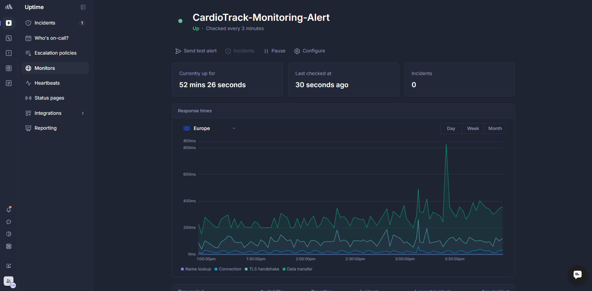
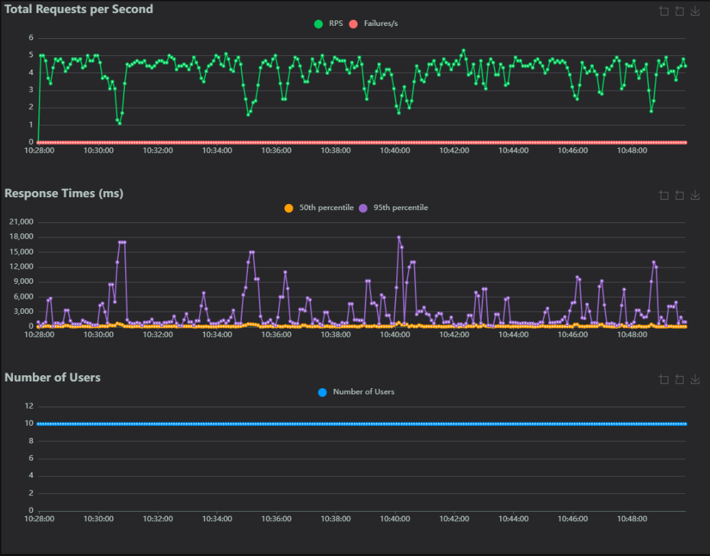
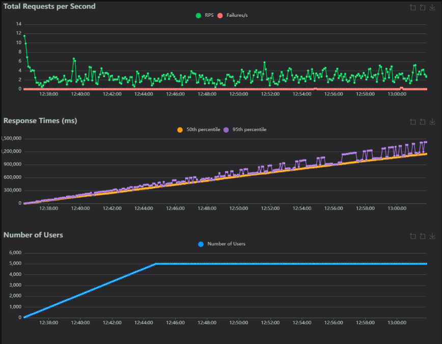

# Reports

This folder contains all the reports generated during the development and testing of the CardioTrack project, including test results, data validation reports, and monitoring figures.

## Folder Structure

```
reports/
├── figures/                        <- Monitoring charts and visualizations
├── great_expectations_reports/     <- Data quality validation reports
└── pytest_report/                  <- Unit and behavioral test report
```

## Unit and behavioral test report

### Behavioral Model Tests

This suite contains **12 tests** focused on validating the ML model behavior. It includes directional tests (verifying that predictions change as expected when features change), invariance tests (ensuring stability under certain transformations), and minimum functionality tests (checking basic model operations). All tests passed successfully.

### Project Tests

The main test suite covers **80 tests** across the entire codebase, including API endpoints, data preprocessing, model training, evaluation, and explainability features. All tests passed successfully.

## Data Validation Reports

Data quality is validated using Great Expectations. The HTML reports in `great_expectations_reports/` show validation results for both the raw and processed datasets, ensuring data integrity throughout the pipeline.

## Monitoring

### Uptime
The Better Stack dashboard displays real-time uptime monitoring for the CardioTrack API hosted on Hugging Face Spaces. The CardioTrack-Monitoring-Alert monitor performs health checks every 3 minutes and is configured to automatically notify the team via email when incidents occur.


## Load Testing - Locust 

Two distinct load tests were conducted using Locust to evaluate the behavior of the system under different execution conditions.

### Load test 1 – Standard load scenario
- Duration: 38 minutes
- Total requests: 9,096
- Failures: 0

This test represents a standard and stable load scenario. Lightweight endpoints for navigation and metadata (/, /cards/*, /model/*) exhibited very low response times (≈15–20 ms on average), confirming high responsiveness.

Prediction endpoints (/predictions and /batch-predictions) showed average latencies around 250 ms, consistent with real-time ML inference.
The explainability endpoint (/explanations) was the most computationally expensive, with an average response time of approximately 3.4 s and peaks up to 21 s, which is expected given the complexity of model explanation processes.

Overall, the system demonstrated high stability, good performance, and balanced behavior under sustained load.


### Load Test 2 – Constrained / Cold-Start Scenario
- Duration: 16 minutes
- Total requests: 2,425
- Failures: 0

In this second test, all endpoints exhibited very high response times, with average latencies in the range of 350–430 seconds and peaks close to 15 minutes. This behavior affected both lightweight endpoints and computationally intensive ones.

Despite the extreme latencies, no requests failed, indicating that the system remained functionally stable. The observed performance degradation is consistent with a constrained execution context, from limited computational resources.
